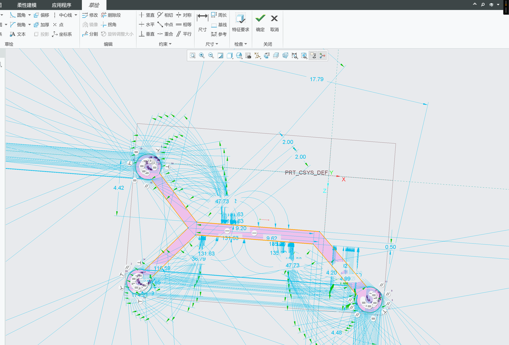

<p align="center">
  
</p>

# AI 辅助 Creo 10 / J-Link 自动 CAD 项目

这是从一组真实的 Creo Parametric 10.0.0.0、Java/J-Link 球体和微流道案例中整理出的可复用 Codex Skill。它把安全修改、工作副本、参数回读、完整再生、几何校验、性能优化和 GUI 备用路线固化为同一套流程。

一句话定位：**让 AI 把自然语言工程需求转化为可验证的 Creo API、参数化模板和 CAD 验收流程，而不是默认模拟人工点击。**

## 要加工的工件与需求

目标工件是一种小型双层流道结构。第一层是三端口基底流道：两个上游/支路端口在中心区域汇合，主流道沿 X 方向居中延伸，再通过斜向连接进入下游出口。第二层建立在第一层顶面，用于布置凸起的导流柱、斜置叶片或阵列微结构，使液体在有限通道长度内产生横向扰动并加强混合。

核心要求是固定端口与共同 XY 基准、使用毫米单位、控制 L1/L2 层高、保证第二层投影位于第一层通道范围内，并保留后续修改内部混合结构的空间。所有修改必须操作工作副本；只有在完整再生、失败特征为 0、关键参数回读和几何检查均通过后才能保存新版本。

## AI 辅助约束草绘实例



截图展示了真实草绘中的三处圆形端口、Y 形汇流段、居中主流道、斜向出口以及大量尺寸/几何约束。AI 可用于整理设计意图、识别单位和约束风险、定位稳定尺寸符号、批量更新参数并触发验证；最终几何质量仍以 Creo 的再生、尺寸回读、包围盒和文件证据为准。

## 能做什么

- 为 Creo 10 Java/J-Link 项目做只读环境盘点和 API 路线选择。
- 在不覆盖原始 `.prt` 的条件下修改工作副本。
- 校验再生、失败特征、参数/尺寸、包围盒、质量属性、保存状态和文件哈希。
- 设计两层微流道、居中主干、斜向出口和凸起混合结构。
- 区分原生参数化特征、导入特征、中性 DXF/STL 验证和仅屏幕可见结果。
- 通过分段计时、批量更新、单次再生和延迟导出优化性能。

## 仓库结构

```text
skills/creo10-jlink-cad-automation/
├─ SKILL.md
├─ agents/openai.yaml
├─ references/
│  ├─ AUTOMATION_SOP_CN.md
│  ├─ DESIGN_PATTERNS_CN.md
│  ├─ PERFORMANCE_FAILURES_CN.md
│  └─ VERIFIED_CASES_CN.md
└─ assets/
   ├─ config.pro.template
   ├─ job.properties.template
   └─ protk.dat.template
```

## 使用

将 `skills/creo10-jlink-cad-automation` 复制到个人 Codex skills 目录，或从本仓库安装。新任务中明确调用：

```text
使用 $creo10-jlink-cad-automation 审查并安全修改这个 Creo 10 工作副本，完成再生、参数回读和保存验证。
```

## 发布范围

本仓库只包含原创说明、脱敏案例数据和配置模板，不包含 Creo 安装文件、PTC `otk.jar`、JDK、`.prt`、大型 STL、课程原件、密码或令牌。实际运行路径和本机证据保存在被 `.gitignore` 排除的 `.local/` 中。

## 已知边界

- 已完整验证：50 mm 球体的 Java 生成二进制 STL → J-Link 导入 → 再生 → Creo 几何/质量属性回读 → 保存。
- 已完整验证：基底流道层 L1 工作副本的 mm 单位、`d411=0.050 mm`、几何厚度、失败特征为 0 和保存结果。
- 仅中性几何验证：居中主干/右下斜向出口版本的 DXF/STL/SVG。
- 尚未最终验收：混合结构层 L2 仍需补充内部导流细节。
- 尚未验证：在免费 J-Link/pfc 路线中从零创建真正原生、可逐尺寸编辑的 Sketch 特征树。

## 许可与商标

原创文本和模板使用 MIT License。Creo、Creo Parametric、J-Link、Object TOOLKIT 和 PTC 是其各自权利人的产品或商标；本项目不分发其专有组件，也不代表 PTC 官方支持。
